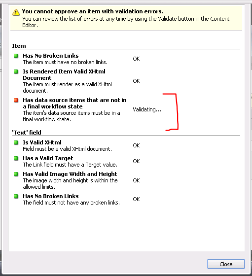
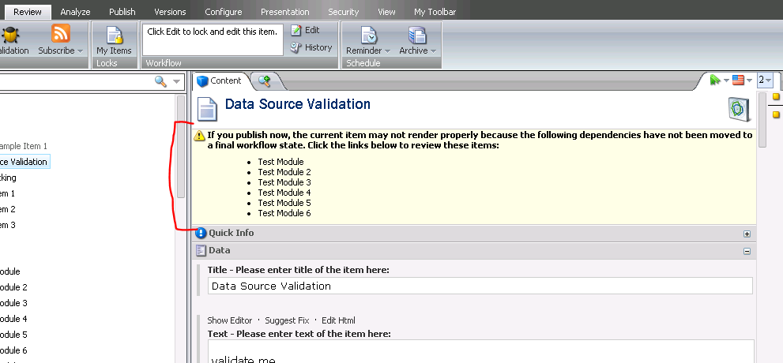
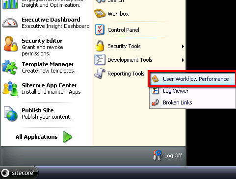
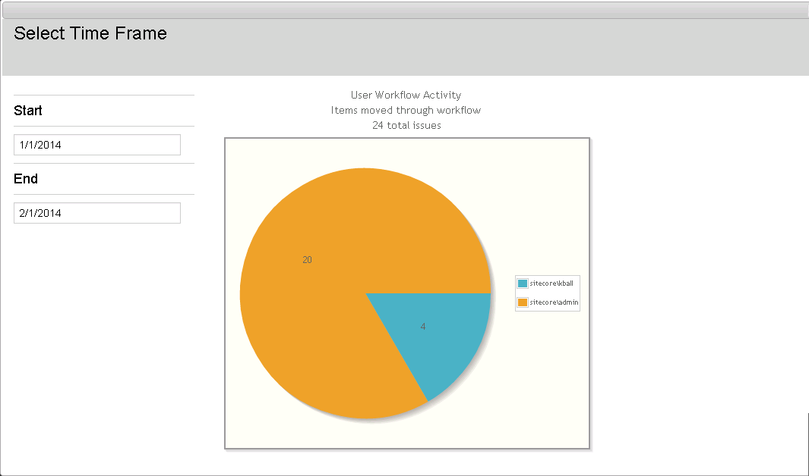
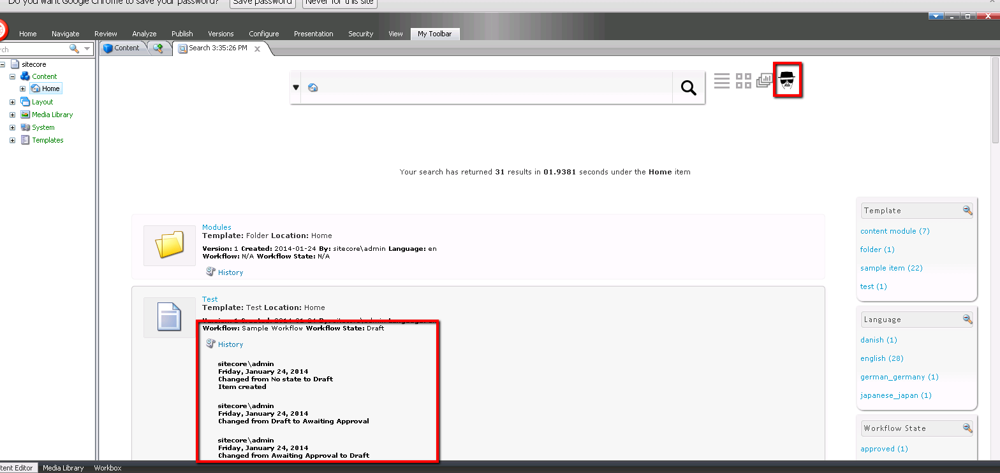
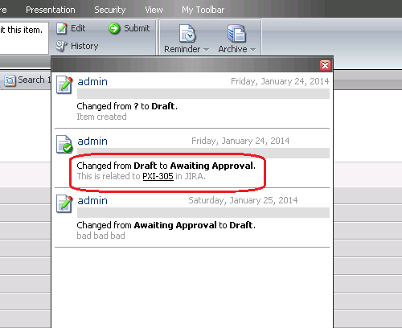
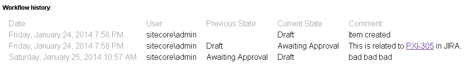
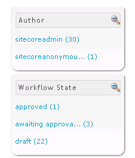

# Heisenberg Workflow Enhancements

This package includes several enhancements to the workflow tools within the Sitecore back-end, many of which leverage improvements introduced in Sitecore 7.1.  Each module is its own enhancement which can be enabled/disabled independently of the other modules.

##1. Data Source Workflow Module
This module has two below components. 
### a. Data Source Workflow Validation Rule:
 This rule prevents an item from being approved if any of its data source items are not in the final workflow state. After installing the package a new validation rule named `Data Source Workflow` is created in */sitecore/system/Settings/Validation Rules/Item Rules/Item*.  If the validation fails, the below screen will be shown to content authors warning them to approve the data source items related to this item. This new rule has to be assigned at the template standard value of the template where this validation is required. It should be assigned to the `Workflow Validation Rules` field in the *Validation Rules* section

### b. Content Editor Warning Message:
 The second part of this component will show a warning message like shown below if the Item is in approved work flow state but one of the dependent *Datasource* items has not been approved

##2. User Workflow Performance Graph
SPEAK application that gives a doughnut graph of users interactions with workflow within a date range for single items. This application does not show the user making the same change to a single item in that range to avoid large amounts of data made between back and forths.
This application is accessible through the *Reporting Tools* on the right side of the *Start Navigation*.

The user is prompted with error messages if entered dates are invalid
When given correct information, the graph shows the total issues modified along with which users worked on those issues.

##3. Workflow Search View
Workflow View from the Search screen that allows users to view the history of items. Uses many new DynamicPlaceholers to show custom data from workflow such as workflow name, workflow state name, and history information

##4. Get Workflow Comments Pipeline (Issue Tracker Module)
The `getWorkflowComments` pipeline was added to allow workflow comments to be modified just before they are rendered to the workflow history control and RSS feeds.
One application of this pipeline has been demonstrated through integration with *bug/issue trackers*.  A pipeline processor will look for references to issue IDs within workflow comments and linking them to their corresponding URLs

There are two configurable settings for this pipeline:
 - The format of the Issue Tracker IDs (regular expression).
 - The URL string format for the issue tracking site.

##5. Workflow State Facet
The workflow state facet allows buckets search results to be narrowed down based on the items’ workflow states.
